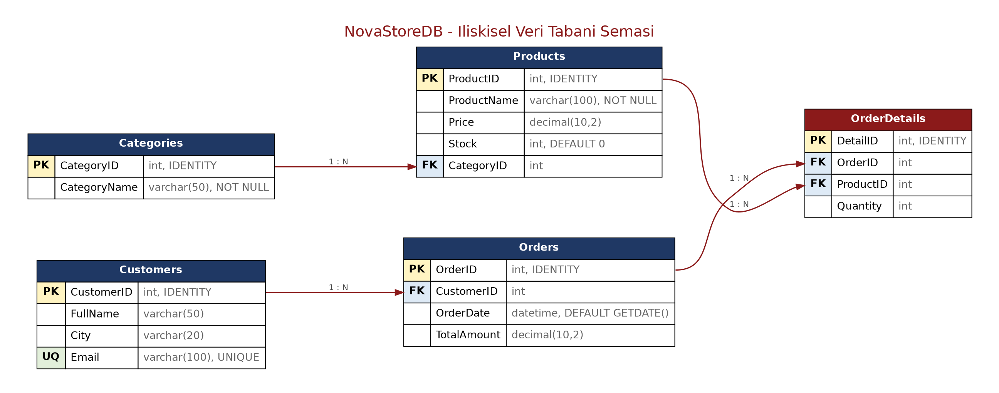

# NovaStore — E-Ticaret Veri Yönetim Sistemi

SQL Server üzerinde tasarlanmış, pet shop temalı ilişkisel bir e-ticaret veri tabanı projesi.
Veri tabanı tasarımı (DDL), örnek veri girişi (DML), analiz sorguları (DQL),
görünüm (VIEW) ve yedekleme adımlarını kapsar.



## Tablo Yapısı

| Tablo | Birincil Anahtar | Yabancı Anahtar | Satır |
|---|---|---|---|
| Categories | CategoryID | — | 5 |
| Customers | CustomerID | — | 6 |
| Products | ProductID | CategoryID | 12 |
| Orders | OrderID | CustomerID | 10 |
| OrderDetails | DetailID | OrderID, ProductID | 20 |

`OrderDetails`, Orders ile Products arasındaki çoktan-çoğa ilişkiyi çözen ara tablodur.

## İçerik

- **Bölüm 1 — DDL:** CREATE DATABASE, CREATE TABLE, PRIMARY KEY, FOREIGN KEY, DEFAULT, UNIQUE
- **Bölüm 2 — DML:** INSERT ile örnek veri, sipariş tutarlarının detaylardan hesaplanması
- **Bölüm 3 — DQL:** 6 analiz sorgusu (WHERE, ORDER BY, INNER/LEFT JOIN, GROUP BY, COUNT, SUM, DATEDIFF)
- **Bölüm 4:** `vw_SiparisOzet` görünümü ve BACKUP DATABASE

## Nasıl Çalıştırılır

SQL Server Management Studio'da dosyayı açıp F5'e basmanız yeterli. Komut satırından:

```
sqlcmd -S localhost -E -C -i GizemBocek_NovaStore_Proje.sql
```

Yedekleme adımından önce `C:\Yedek` klasörünün oluşturulmuş olması gerekir.

## Dosyalar

- `GizemBocek_NovaStore_Proje.sql` — baştan sona çalıştırılabilir T-SQL scripti
- `GizemBocek_NovaStore_Proje.docx` — kod, çıktı ve açıklamaları içeren rapor
- `GizemBocek_NovaStore_Proje.png` — ilişkisel şema diyagramı
- `ciktilar/` — sorgu sonuçlarının görselleri

---

Hazırlayan: **Gizem Böcek**
